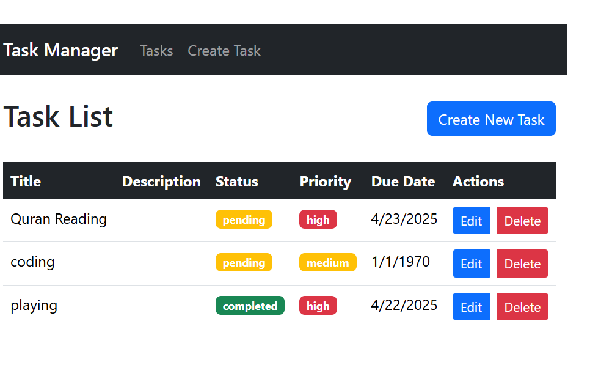
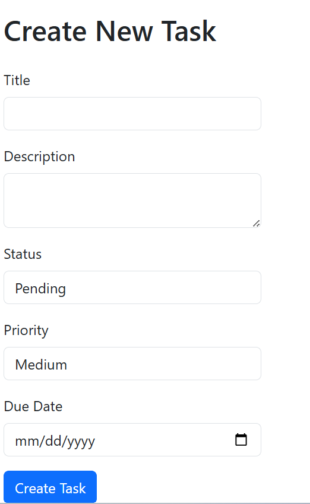
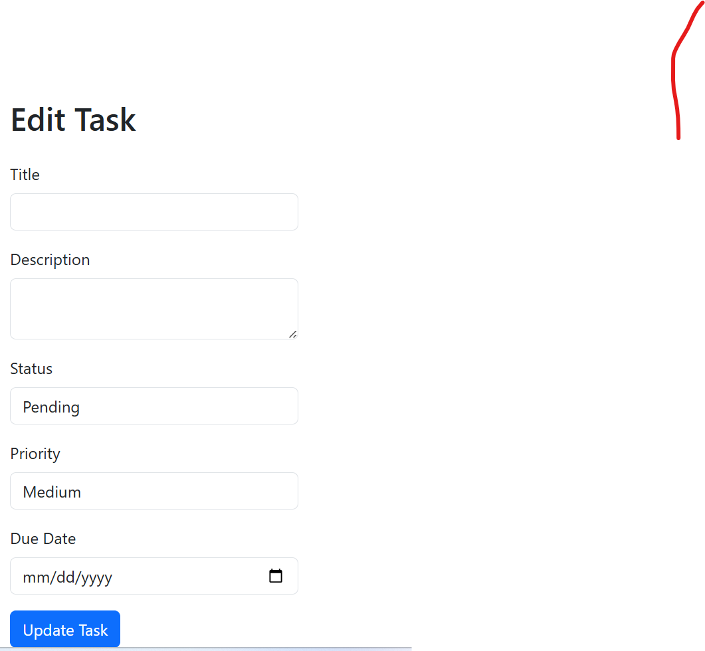

# Task Manager App

A full-stack Task Manager application built with the MERN stack (MongoDB, Express.js, React, Node.js).

## Features

- Create, Read, Update, Delete tasks (CRUD)
- Status and Priority badges
- Due date validation
- Responsive and clean UI with Bootstrap
- Error handling and loading states

## Tech Stack

- **Frontend**: React, Bootstrap, Axios, React Router
- **Backend**: Node.js, Express.js
- **Database**: MongoDB (with Mongoose)
- **Others**: Git, GitHub

## Installation

1. Clone the repository:

```bash
   git clone https://github.com/queenhabeebah/Task-Manager-App.git
   cd Task-Manager-App
```
2. Install server dependencies:

```bash
cd server
npm install
```
3. Install client dependencies:

```bash
cd ../client
npm install
```
4. Set up your environment variables (e.g., MongoDB URI) in a .env file in the server folder.

5. Run the app:

- In one terminal:

```bash
cd server
npm run dev
```
- In another terminal:

```bash
cd client
npm start
```
## Screenshots





## Author
Habeebah Aleilo

🔗 [GitHub](https://github.com/queenhabeebah)  
💼 [LinkedIn](https://linkedin.com/in/habeebah-aleilo)

## License
This project is open source and free to use.
